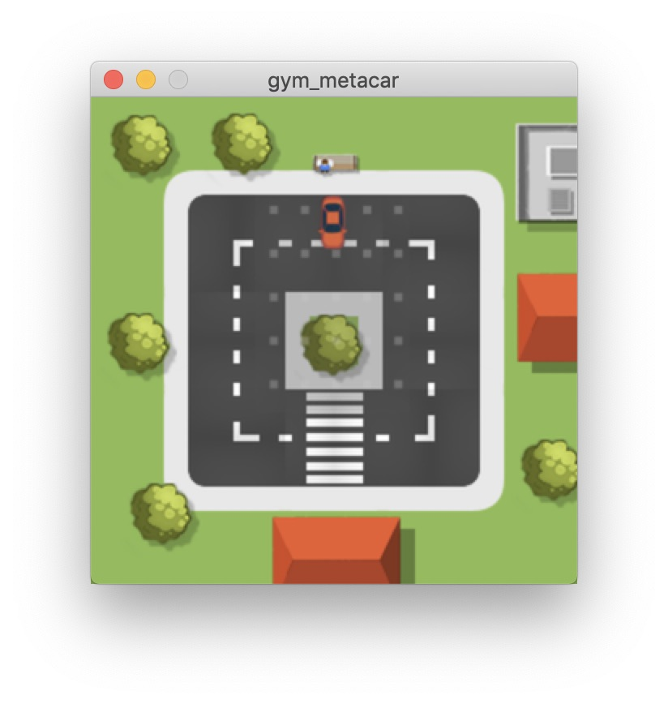
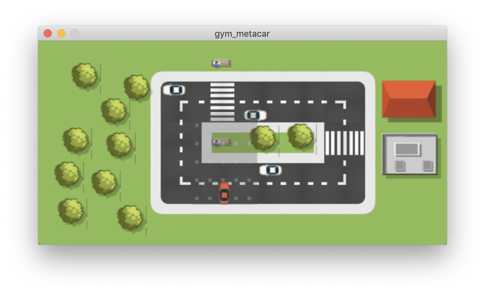
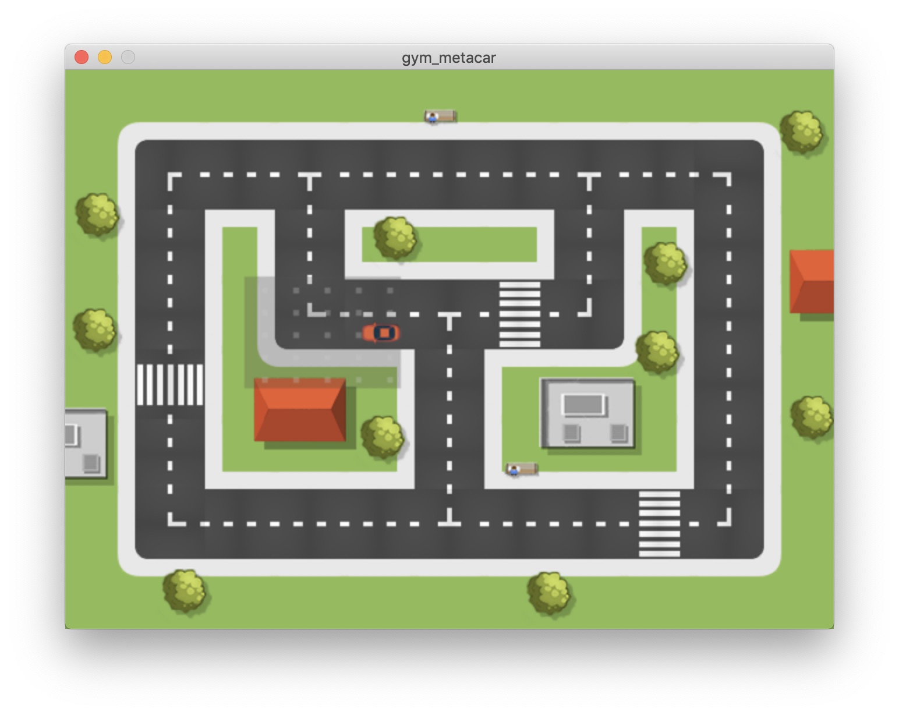
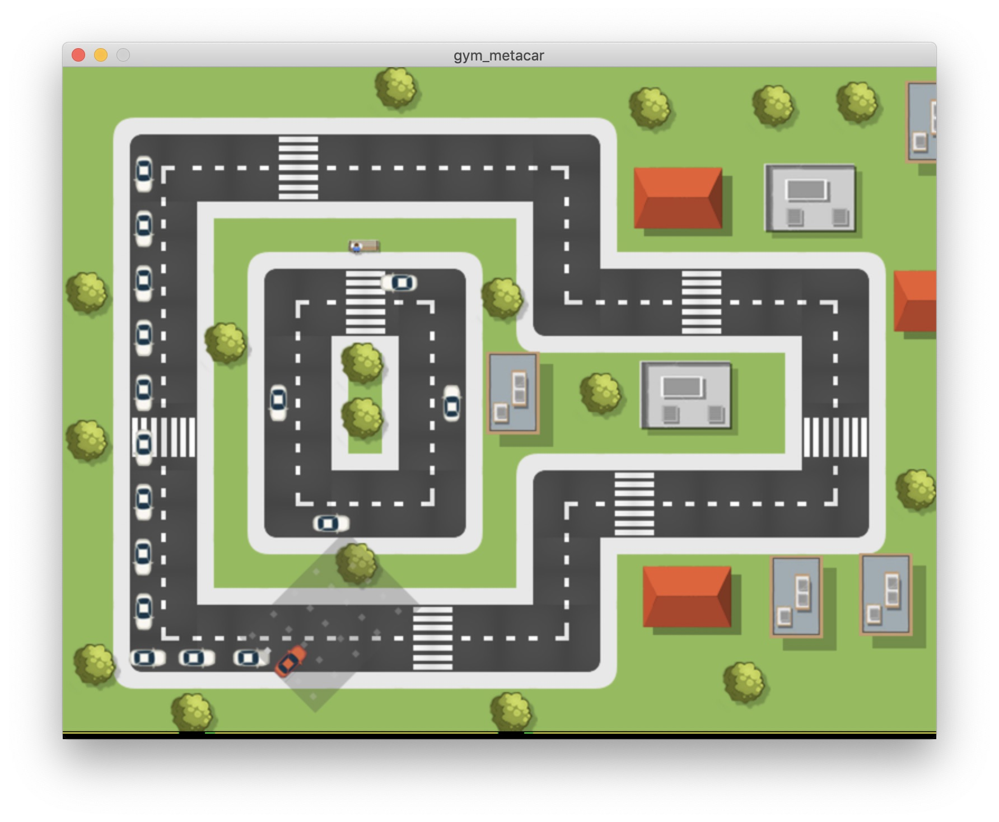

# Gym-Metacar.

OpenAI Gym wrapper for Metacar: A reinforcement learning environment for self-driving cars in the browser. Uses selenium to wrap the original web-code.

If you want to learn more, go to the official metacar homepage:
[https://www.metacar-project.com](https://www.metacar-project.com)


# Getting in touch.

If you got any bug reports or feature requests, please open an issue here on GitHub.

- [Becoma a patron](https://www.patreon.com/ai_guru).
- [Subscribe to my newsletter](http://ai-guru.de/newsletter/).
- [Visit by homepage/blog](http://ai-guru.de/).
- [Join me on Slack](https://join.slack.com/t/ai-guru/shared_invite/enQtNDEzNjUwMTIwODM0LTdlOWQ1ZTUyZmQ5YTczOTUxYzk2YWI4ZmE0NTdmZGQxMmUxYmUwYmRhMDg1ZDU0NTUxMDI2OWVkOGFjYTViOGQ).
- [Add me on LinkedIn](https://www.linkedin.com/in/dr-tristan-behrens-ai-guru-734967a2/).
- [Add me on Facebook](https://www.facebook.com/AIGuruTristanBehrens).

# Installation.

Straightforward:

```
pip/conda install git+https://github.com/AI-Guru/gym-metacar
```

**Note:** Please make sure that ```chromedriver``` is installed on your system.

## Mac. 

```
brew cask install google-chrome
brew cask install chromedriver
```

## Linux. 

```
apt install chromium-chromedriver
apt-get install -y libglib2.0-0 libnss3 libgconf-2-4 libfontconfig1
```

## Windows.

Consider moving to Mac/Linux ;)

# Environments.

A total of four different levels are available. Each can be instantiated with either discrete or continous action spaces.

The complete list of environments:


- ```metacar-level0-discrete-v0```
- ```metacar-level0-continuous-v0```
- ```metacar-level1-discrete-v0```
- ```metacar-level1-continuous-v0```
- ```metacar-level2-discrete-v0v0```
- ```metacar-level2-continuous-v0```
- ```metacar-level3-discrete-v0```
- ```metacar-level3-continuous-v0```


# How to run.

As with all gym-compatible environments, gym-metacar is very easy to run.

```python
import gym
import gym_metacar

env = gym.make("metacar-level0-discrete-v0)
env.reset()
print(env.observation_space)
print(env.action_space)

for step in range(100):
    print(step)
    observation, reward, done, info = env.step(env.action_space.sample())
    env.render()
env.close()
```

# Screenshots.

## Level0.



## Level1.



## Level2.



## Level3.




# Wrappers.

As all good environments, gym-metacar comes with wrappers.

- ```gym_metacar.wrappers.LidarObservationWrapper```: Just uses the lidar-data in the observations.
- ```gym_metacar.wrappers.LinearObservationWrapper```: Just uses the linear-data in the observations.
- ```gym_metacar.wrappers.TerminateWrapper```: Terminates the simulation if the reward is -1.
- ```gym_metacar.wrappers.ClipRewardsWrapper ```: Clips the rewards to [-1, 1].


Example:

```
import gym
import gym_metacar
from gym_metacar.wrappers import *

env_id = "metacar-level3-discrete-v0"
env = gym.make(env_id)
env = LinearObservationWrapper(env)
env = ClipRewardsWrapper(env)
env = DummyVecEnv([lambda:env])
env = VecFrameStack(env, n_stack=4)
```

# Rendering with Web-Driver.

Per default, the environment renderer uses PyGame. If you want to use the web-renderer, you have to instantiate it explicitely:

```
import gym
import gym_metacar
from gym_metacar.wrappers import *

env_id = "metacar-level3-discrete-v0"
env = gym.make(env_id)
env.enable_webrenderer() # This enables the web-renderer.
[...]
```

# Deep Reinforcement Learning.

The ```examples``` folders contains a DQN-agent. Note: This requires [stable baselines](https://github.com/hill-a/stable-baselines).

For training:

```
python metacar_dqn_train.py
```

For running after training:

```
python metacar_dqn_enjoy.py
```

Thank you!